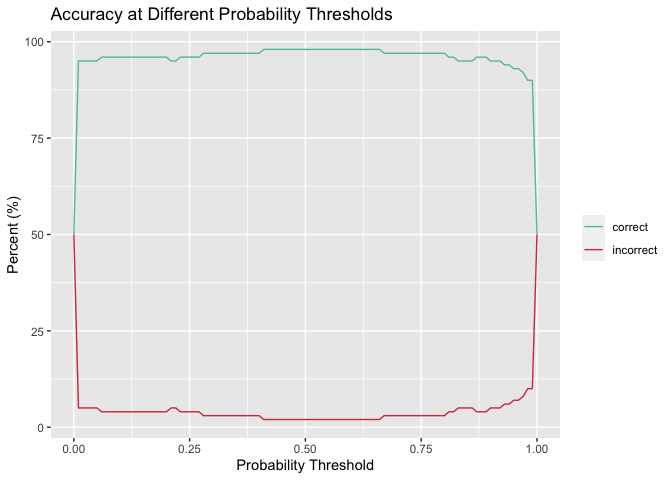
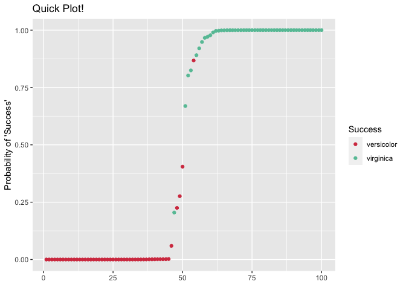
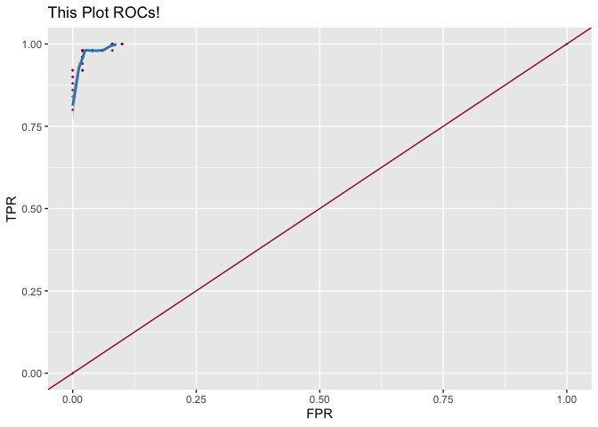

<!-- README.md is generated from README.Rmd. Please edit that file -->

# mcguiR

<!-- badges: start -->

<!-- badges: end -->

mcguiR aims to provide functions that ease the burden of determining how
well a model performs, as well as comparing between models.
Unfortunately, it only supports binary logistic regression (for now\!).

## Installation

Install from GitHub using:

``` r
# install.packages("devtools")
devtools::install_github("bmcguir8/mcguiR")
```

## Using the Functions

Since this package is only equipped to deal with binary logistic
regression modeling, we’ll need to edit one of the better known R
datasets to show some examples:

``` r
data("iris")
iris2 <- iris[stringr::str_detect(iris$Species, "setosa", negate = T), ]
irismodel <- glm(Species ~ ., data = iris2, family = binomial)

library(mcguiR)
```

To do this, we’re just going to remove all the rows where Species ==
“setosa” within the iris dataset, and generating a model using it.
Now, to see the functions in action\!

accuracy() and acc\_plot() used together gives you a plot of the percent
of ‘calls’ that are correct or incorrect from your model at each
probability threshold (where every sample with a predicted probability
above this cut off is deemed a ‘success’ and everything below is a
‘failure’ - in this case, virginica is ‘success’).

``` r
acc_data <- accuracy(irismodel, iris2, iris2$Species, "virginica", "versicolor")
acc_plot(acc_data, y = "both")
```



You might also want to see how well your model ranked individual samples
compared to their true call. You can do this with quickplot(), which
gives you each sample, colored by their actual category, and ranked in
ascending order of predicted probability. This is a good way to tell if
your model gets a little blurry towards the middle, or one specific
side:

``` r
quickplot(irismodel, iris2, iris2$Species, "Quick Plot!")
```



There are also functions for calculating the TPR (True Positive Rate)
and FPR (False Positive Rate) for your model at each probability cutoff,
ROC\_value() and then plotting these values, ROC\_plot(). You will also
find a wrapper function for DescTools::AUC(), that fills in x and y for
you to save time.

``` r
roc <- ROC_value(irismodel, iris2, iris2$Species, "virginica", "versicolor")
ROC_plot(roc, title = "This Plot ROCs!")
#> Warning: Removed 72 rows containing missing values (geom_smooth).
```



``` r
AUC_wrapper(roc)
#> [1] 0.988
```

Finally, there is a function that identifies ‘problem samples’ for you.
It comes with a few values filled in for you: standard (standardized
residuals), student (studentized residuals), df\_fits (DFFITS), and
cooks (Cook’s distance). The function will return all data points with
values greater than or equal to what these are set to.

``` r
middlechild <- problem_samples(irismodel, iris2, k = 4)
kable(head(middlechild))
```

|    | Sepal.Length | Sepal.Width | Petal.Length | Petal.Width | Species    |      prob | standard\_residuals | student\_residuals |   df\_fits |  leverage | expected\_levarage | cooks\_distance |
| :- | -----------: | ----------: | -----------: | ----------: | :--------- | --------: | ------------------: | -----------------: | ---------: | --------: | -----------------: | --------------: |
| 19 |          6.2 |         2.2 |          4.5 |         1.5 | versicolor | 0.0595982 |         \-0.4514313 |        \-0.4057237 | \-1.038364 | 0.3969482 |               0.05 |       0.0138348 |
| 21 |          5.9 |         3.2 |          4.8 |         1.8 | versicolor | 0.4048381 |         \-1.4731489 |        \-1.3341597 | \-4.783103 | 0.5217680 |               0.05 |       0.3103676 |
| 23 |          6.3 |         2.5 |          4.9 |         1.5 | versicolor | 0.2248338 |         \-0.8810672 |        \-0.8132354 | \-1.854212 | 0.3438501 |               0.05 |       0.0463297 |
| 28 |          6.7 |         3.0 |          5.0 |         1.7 | versicolor | 0.2760617 |         \-1.0377464 |        \-0.9488793 | \-2.497509 | 0.4000485 |               0.05 |       0.0847647 |
| 34 |          6.0 |         2.7 |          5.1 |         1.6 | versicolor | 0.8676299 |         \-2.2359248 |        \-2.3647735 | \-4.010642 | 0.1910351 |               0.05 |       0.3826734 |
| 57 |          4.9 |         2.5 |          4.5 |         1.7 | virginica  | 0.8908123 |           0.7548438 |          0.6408512 |   2.630901 | 0.5941604 |               0.05 |       0.0884326 |
